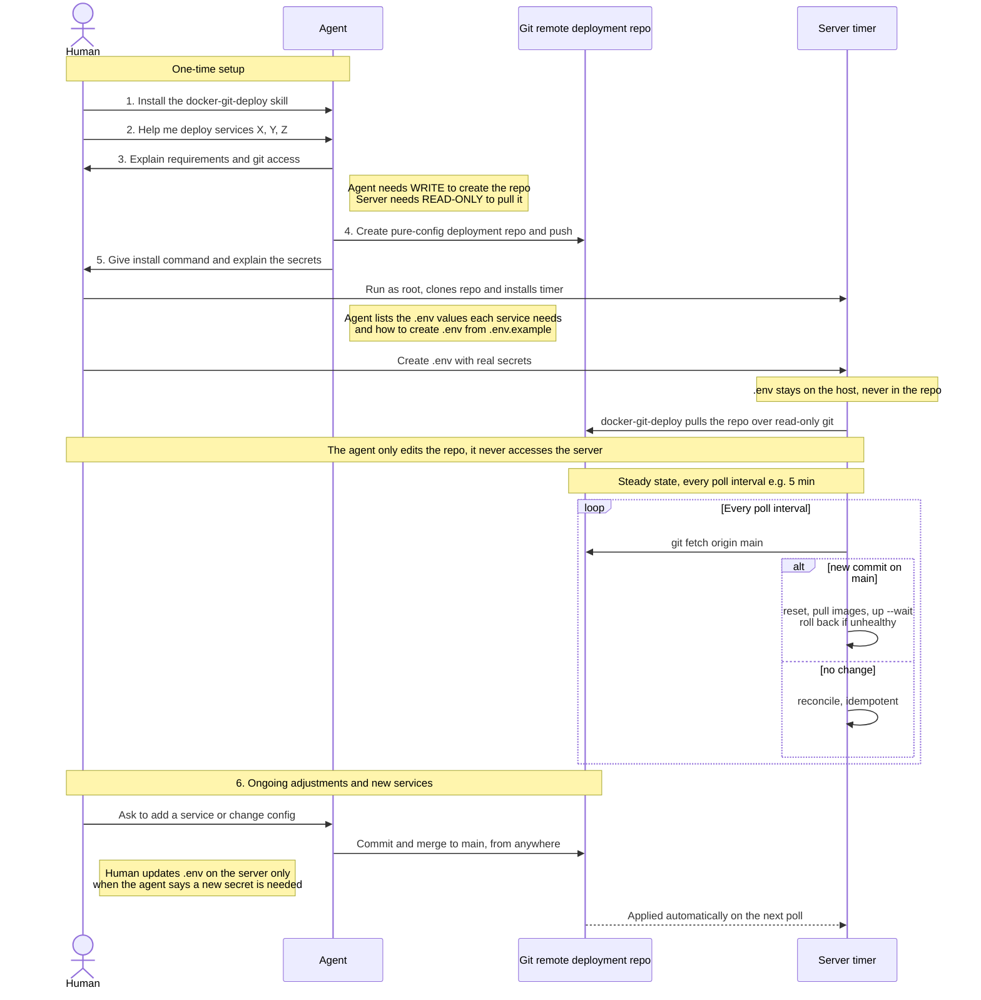

# docker-git-deploy

Pull-based GitOps for Docker Compose on a single host — with an agent skill.

You edit a **deployment repo** (pure config). The production host runs a systemd
timer that pulls the repo and reconciles the Compose stack with
`docker compose up -d --wait`. No SSH or push access to the host is required; the
host only needs **outbound HTTPS** and **read-only** Git access.

The deployment repo can live on **any Git host** — GitHub, GitLab, Bitbucket, or
self-hosted — since the tool only runs `git clone`/`git fetch` and
`--deployment-repo` accepts any git URL.

**This repository is the skill and its tooling** — it has no compose config at
its root. The canonical example is bundled at
[docker-git-deploy-skill/assets/starter/](docker-git-deploy-skill/assets/starter/),
which is also the fixture CI deploys and the template new deployment repos are
generated from.

## Why use it

- **Version-controlled homelab, for free.** Every service and config change lives
  in Git — full history, diffs, and blame across your whole stack, at no extra
  effort. Your infrastructure is described in one place instead of scattered
  across hand-run `docker` commands.
- **Stand up a new server in minutes.** Point a fresh host at the same repo with
  one bootstrap command and it converges to your exact stack — ideal for
  migrations, disaster recovery, or adding a second node. The repo *is* the
  source of truth.
- **Real change management.** Changes land as commits (and PRs, if you want
  review); the host applies only what's on `main`, and a bad update rolls back
  automatically. Everything is auditable and reversible.
- **Let an agent do the hard work — without agent tooling on your server.** The
  agent edits the repo from anywhere; the server only ever pulls, read-only. No
  agent, SSH keys, or Docker socket is exposed to whatever is editing your
  config.

## How it works

The typical flow, from asking an agent for help to hands-off updates:



1. **Install the skill.** The human asks the agent to install this skill.
2. **State the goal.** The human asks the agent to deploy services X, Y, Z to a server.
3. **Scope it.** The agent asks about the current server, explains the [minimum
   requirements](docker-git-deploy-skill/references/prerequisites.md), and
   explains the git access involved — the **agent needs write** access to
   create and push the deployment repo, while the **server only needs read-only**
   access to pull it. Any Git host works (GitHub, GitLab, Bitbucket, self-hosted).
4. **Create the deployment repo.** The agent generates a pure-config repo from
   the starter (compose files, service definitions, `.env.example`) and pushes it
   to the git remote.
5. **Bootstrap the server.** The agent hands the human a one-line install command
   to run as root on the server; it clones the repo and installs the systemd
   timer. The agent also explains **which secrets and environment values each
   service needs** (derived from the repo's `.env.example`) and **how to create
   the `.env`** on the host — e.g. `cp .env.example .env` and then fill in real
   values. The deploy is skipped until `.env` exists, and secrets never live in
   the repo. The agent helps troubleshoot but never needs access to the server
   itself.
6. **Ongoing adjustments and new services.** From then on, the human asks the
   agent to add a service or change config, and the agent commits it to the repo
   and merges to `main` — from any location, with no server access. The server
   polls `origin/main` on its timer and applies the change automatically,
   reconciling with `docker compose up -d --wait` and rolling back if a new
   version fails to become healthy. The human's **only** manual step is updating
   `.env` on the server — and only when the agent says a new or changed service
   needs a new secret.

## For agents

Install the skill (replace `<your-agent>` with your agent's identifier):

```bash
npx skills add https://github.com/linksawakening/docker-git-deploy --skill docker-git-deploy-skill -a <your-agent> -g -y --copy
```

Then follow the adoption flow in
[docker-git-deploy-skill/SKILL.md](docker-git-deploy-skill/SKILL.md).

## Try it

Generate a deployment repo from the bundled starter, push it, then bootstrap a
host:

```bash
# 1. Generate a pure-config deployment repo (autoheal by default)
docker-git-deploy-skill/scripts/init-deployment.sh \
  --target-dir ~/myhost-deploy --repo-name myhost-deploy \
  --host-name myhost --org <your-org>

# 2. Push it to your git remote (see the generated README)

# 3. On the host, as root. --deployment-repo takes any git URL (GitHub,
#    GitLab, Bitbucket, self-hosted; HTTPS or SSH):
curl -fsSL https://raw.githubusercontent.com/linksawakening/docker-git-deploy/main/docker-git-deploy-skill/scripts/install.sh | \
  bash -s -- \
    --deployment-repo <your-deployment-repo-git-url> \
    --deployment-dir /opt/myhost-deploy \
    --interval 5min

# 4. Create /opt/myhost-deploy/.env from .env.example
```

The deploy runs as an unprivileged `docker-git-deploy` user by default (pass
`--user root` to run privileged). The framework installer above is fetched from
GitHub; you can also clone the framework and run `install.sh` locally, or point
`--framework-repo` at a mirror.

## The example service: autoheal

The starter ships [autoheal](https://github.com/willfarrell/docker-autoheal),
which restarts any container that reports `unhealthy`. Opt a service in by giving
it `labels: [autoheal=true]` and a `healthcheck:`. It's a small, genuinely useful
homelab default and it exercises the health-aware deploy end to end.

## Structure

```text
├── README.md · LICENSE · .gitignore
├── .github/workflows/
│   ├── validate.yaml            # lint the starter compose
│   └── install-test.yaml        # install → deploy → assert autoheal is up
└── docker-git-deploy-skill/     # the skill package (framework + skill + starter)
    ├── SKILL.md
    ├── references/
    ├── scripts/                 # install.sh, docker-git-deploy CLI, init, validate
    └── assets/
        ├── systemd/             # unit templates
        └── starter/             # pure-config example == starter == CI fixture
```

## License

MIT — see [LICENSE](LICENSE).
